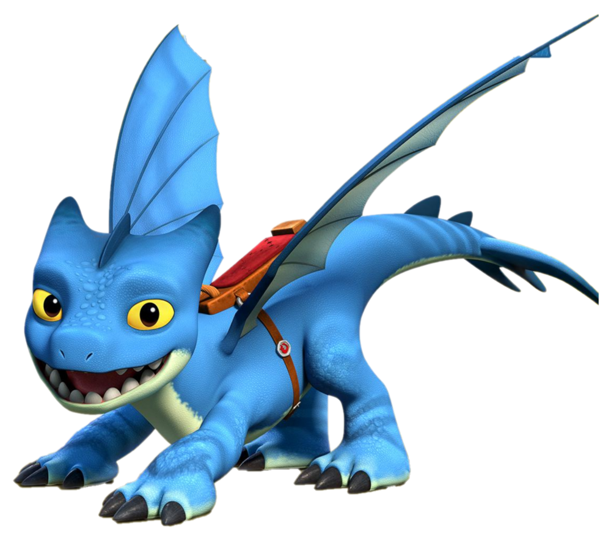
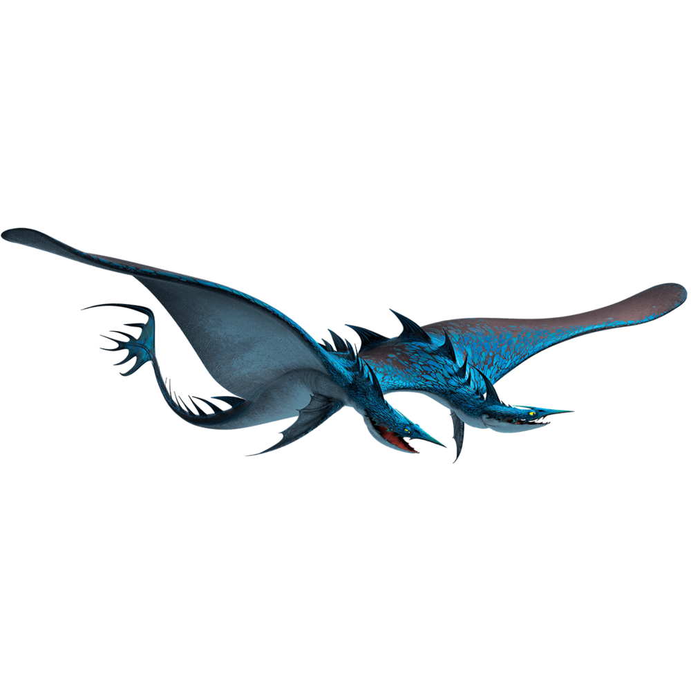

### GitHub username: Lydia12138
### Date: 2022-01-26 Repo:https://github.com/Lydia12138/Dragon-Phylogeny

```{r setup, include=FALSE}
knitr::opts_chunk$set(echo = TRUE)
```

## load the packages
```{r,warning=FALSE, message=FALSE}
library(ape)
library(reshape2)
library(ggplot2)
library(ggtree)

```

## Input the Data about Dragons
```{r}
DragonNexus <- read.nexus.data("input/DragonMatrix.nex")
```


There are 3 Dragons I find. According to the characteristics for each of my 3 dragons, I adding the data into original Data. Here I post the picture and website link for each dragon.


 
 Figure 1:Swiftwings: the fastest dragons on the planet

[link to the website page about Swiftwings information](https://howtotrainyourdragon.fandom.com/wiki/Swiftwing) 



Figure 2:Seashocker: a large Tidal Class dragon that first appeared in How to Train Your Dragon 2.
[link to the website page about Seashocker information](https://howtotrainyourdragon.fandom.com/wiki/Seashocker) 


Figure 3:The Night Fury is a medium-sized Strike Class dragon that first appeared in How to Train Your Dragon. This one name Toothless

[link to the website page about Seashocker information](https://howtotrainyourdragon.fandom.com/wiki/Night_Fury) 


## Apply the same traits weightings--Weights
The Weights.csv data table has a set of weights that were used for creat dragons phylogeny

```{r}
WeightsDat <- read.csv("input/Weights.csv")
```

## Create a single vector of weights. 
```{r}
Weights <- paste0(WeightsDat$Weight, collapse = "")
Weights <- strsplit(Weights, split = "")[[1]]
```

## Covert each letter to a value
```{r}
WeightsNum<-rep(NA,length(Weights))
for(i in 1:length(WeightsNum)){
  if(Weights[i] %in% LETTERS){
    WeightsNum[i]<-which(LETTERS==Weights[i])+9
  } else {
    WeightsNum[i]<-Weights[i]
  }
} # ceart a loop to encode very single letter individually

WeightsNum<-as.numeric(WeightsNum) # convert the output into number. 
```


## Multiply the weight value by the trait vector for each dragon
```{r}
WtDragonNexus<-DragonNexus # Make a new weighted data frame object
for (i in 1:length(DragonNexus)){
  RepWeight<-DragonNexus[[i]]==1
  WtDragonNexus[[i]][RepWeight]<-WeightsNum[RepWeight]
  RepWeight<-NA
}
```


## Calculate the distance matrix
```{r warning=FALSE}
WtDragonNexusDF<-data.frame(matrix(unlist(WtDragonNexus),ncol=78,byrow=T))
row.names(WtDragonNexusDF)<-names(WtDragonNexus)
WtDragonDist<-dist(WtDragonNexusDF,method='euclidean')
WtDragonDistMat<-as.matrix(WtDragonDist)
```


```{r fig.height=7, fig.width=8}
WtPDat<-melt(WtDragonDistMat)
ggplot(data = WtPDat, aes(x=Var1, y=Var2, fill=value)) + 
  geom_tile()+scale_fill_gradientn(colours=c("white","blue","green","red")) +
  theme(axis.text.x = element_text(angle = 90, hjust = 1, vjust = 0.5))
```

Figure 4. Pairwise distance matrices for 80 dragons.Var1 and Var2 represent serial number of dragons, and colour represent the different distance. 


## Plot the tree
```{r}
WtDragonTreeNJ<-nj(WtDragonDist)
```

```{r}
names <- gsub("[0-9\\.]+([^X]+)X*","\\1",WtDragonTreeNJ$tip.label)
Names <- gsub("\\d","Unknow",names)
# Deal with the name of each dragon
WtDragonTreeNJ$tip.label <- gsub("([0-9\\.]+[^X]+)X*","\\1",WtDragonTreeNJ$tip.label)
# Simplify the name of each dragon
Groups<-split(WtDragonTreeNJ$tip.label, Names) 
# Divide dragons into group depend on the names of dragon 
WtDTcol<-groupOTU(WtDragonTreeNJ,c(Groups$Tooth,Groups$Swift,Groups$Seashock))
# Find my dragons 
NodeCA <- MRCA(WtDTcol, .node1 = "75Tooth", .node2 =  "76Seashock", .node3 =  "77Swift" )
# Find the most recent common ancestor of my dragons.
```

## Creat a Dragon Phylogeny
```{r,fig.height=8, fig.width=8, r,warning=FALSE}
ggtree(WtDTcol,layout="circular",aes(colour=group))+
  geom_tiplab(size=2,aes(angle=angle))+
  geom_point2(aes(subset=(node==NodeCA)), size=2, fill='red')+
  scale_color_manual(values=c("Black", "red"), 
                     labels = c("Other Dragon", "My Dragon"))
```

Figure 5. Phylogenetic tree of dragon constructed by a neighbor-joining method with weightings. Red taxon represent three dragons which I find. The red point shows the common ancestor.


